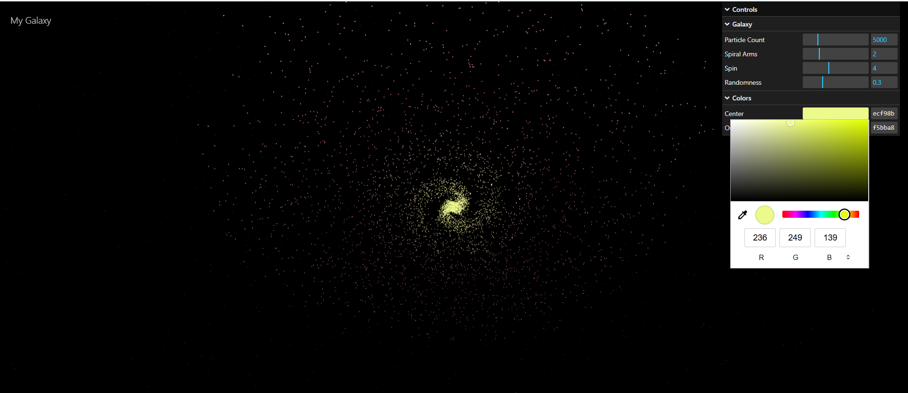

# 🌌 Spiral Galaxy

A real-time, interactive 3D spiral galaxy rendered with [Three.js](https://threejs.org/) and WebGL. Built with vanilla JavaScript and bundled with Vite. Fully responsive with live tweakable controls powered by lil-gui.



## Live Demo

🌐 **[https://spiral-galaxy-phi.vercel.app](https://spiral-galaxy-phi.vercel.app)**

A polished, interactive 3D spiral galaxy rendered entirely in the browser. Drag to orbit around the galaxy, scroll to zoom, and use the control panel to reshape the galaxy in real time.

## Features

| Feature | Description |
|---|---|
| 🌀 **Spiral Galaxy** | 5,000 particles arranged into two spiral arms using polar coordinates |
| 🌟 **Per-Particle Colors** | Smooth gradient from warm yellow-white at the center → pink/magenta → deep blue-violet at the edges |
| ✨ **Subtle Glow** | A soft, semi-transparent particle layer behind the stars creates a natural star-glow halo |
| ⭐ **Background Stars** | 2,000 faint, distant white stars that remain fixed while you orbit the galaxy |
| 🖱️ **Orbit Controls** | Click-drag to rotate around the galaxy, scroll to zoom, with smooth damping |
| 🎛️ **Live GUI** | Interactive control panel (lil-gui) to tweak particle count, arms, spin, randomness, and colors |
| ⏱️ **Frame-Rate Independent** | Uses `THREE.Timer` for smooth animation regardless of device performance |
| 📱 **Responsive** | Full-screen canvas that adapts to desktop and mobile screen sizes |
| ⚡ **Vite Dev Server** | Fast hot-module reloading during development |

## Interactive Controls

The lil-gui panel appears in the top-right corner of the screen with two folders:

### Galaxy Parameters

These controls **rebuild the galaxy** when changed (the geometry and materials are regenerated):

| Control | Range | Default | What It Changes |
|---|---|---|---|
| **Particle Count** | 500 – 20,000 | 5,000 | Total number of particles in the galaxy. More particles look denser but cost more GPU performance. |
| **Spiral Arms** | 1 – 5 | 2 | Number of spiral arms. Each arm is offset by 360°/N around the center. |
| **Spin** | 0 – 10 | 4 | How tightly wound the spiral is. Higher values make more rotations as you move outward from the center. |
| **Randomness** | 0 – 1 | 0.3 | How fuzzy and natural-looking the spiral arms appear. Lower values produce cleaner, thinner arms. |

### Color Parameters

These controls **update live** without rebuilding the geometry:

| Control | What It Changes |
|---|---|
| **Center Color** | Color of particles near the galactic core (default: warm yellow-white) |
| **Outer Color** | Color of particles at the galaxy's edges (default: deep blue-violet) |

The center color smoothly blends through a fixed pink-magenta midpoint to the outer color.

### Keyboard / Mouse Interactions

| Action | Result |
|---|---|
| **Drag (mouse)** | Orbit around the galaxy center |
| **Scroll (mouse wheel)** | Zoom in and out |
| **Drag (touch)** | Orbit on mobile/tablet |
| **Pinch (touch)** | Zoom on mobile/tablet |

## Technologies Used

| Technology | Version | Purpose |
|---|---|---|
| **JavaScript (ES modules)** | ES2023+ | Language — plain JavaScript, no frameworks |
| **Three.js** | ^0.186.1 | 3D graphics library rendered via WebGL |
| **WebGL** | — | Browser-based 2D/3D graphics API (used by Three.js) |
| **Vite** | ^8.3.2 | Build tool and development server with hot reloading |
| **lil-gui** | ^0.21.0 | Minimalist GUI control panel for live parameter tweaking |
| **OrbitControls** | three.js examples | Mouse/touch-based camera orbiting and zooming |
| **THREE.Timer** | three.js | Modern time-tracking replacement for the deprecated THREE.Clock |
| **BufferGeometry** | three.js | Efficient GPU-friendly storage for particle positions and colors |
| **THREE.Points** | three.js | Renders large numbers of particles as GPU-accelerated point sprites |

## How the Galaxy Works

The galaxy is generated procedurally using a combination of polar coordinates and randomness:

1. **Particle distribution** — Each of the 5,000 particles is assigned a random radius from the center. Squaring the random value (`Math.pow(Math.random(), 2)`) concentrates more particles near the core, making it dense and bright.

2. **Spiral arms** — Using polar coordinates (radius + angle), each particle is assigned to one of two arms. The key formula is `angle = baseAngle + radius * spin`, which makes the angle increase as the radius increases — this is what creates the spiral curve.

3. **Natural spread** — A small random offset is added to both the angle and radius of each particle, so the arms look fuzzy and organic instead of perfectly thin mathematical lines.

4. **Color gradient** — The particle's distance from the center determines its color. Particles near the center get warm yellow-white tones, blending through pink/magenta in the middle, and shifting to deep blue-violet at the edges.

5. **Glow effect** — A second `THREE.Points` layer shares the same geometry but uses a larger, semi-transparent material with a soft circular texture, creating a halo behind each star.

6. **Background stars** — 2,000 faint white points are spread across a large sphere (20–100 units away) on a separate geometry. They stay fixed while the galaxy rotates.

7. **Slow rotation** — The galaxy completes one full rotation every ~60 seconds, driven by `THREE.Timer.getElapsedTime()` for frame-rate independence.

## Three.js Concepts Used

| Concept | How It's Used |
|---|---|
| **Scene** | Container holding the camera, particles, and background. Black background color. |
| **PerspectiveCamera** | Simulates human vision with perspective foreshortening. Positioned above the galaxy at a 30° angle. |
| **WebGLRenderer** | Draws the 3D scene to a 2D canvas. Pixel ratio capped at 2 for performance. |
| **BufferGeometry** | Stores all particle positions and colors in typed arrays (`Float32Array`) uploaded once to the GPU. |
| **THREE.Points** | Renders the BufferGeometry as a cloud of point sprites (dots). Used for both the galaxy and background stars. |
| **PointsMaterial** | Defines how each point looks: size, color, opacity, texture map. |
| **BufferAttribute** | Wraps the typed arrays and attaches them to the geometry as named attributes ("position", "color"). |
| **CanvasTexture** | A soft radial-gradient circle drawn on an HTML canvas, used as the point sprite map for the glow effect. |
| **OrbitControls** | Adds mouse/touch orbit and zoom to the camera with optional damping. |
| **THREE.Timer** | Tracks elapsed time for frame-rate-independent animation. Replaces the deprecated THREE.Clock. |

## Project Structure

```
spiral-galaxy/
├── index.html          # HTML entry — minimal, just loads CSS and JS
├── package.json        # npm scripts and dependency list
├── package-lock.json   # Locked dependency versions
├── screenshots/
│   └── spiral-galaxy.png  # Project screenshot
└── src/
    ├── main.js          # All Three.js scene, galaxy logic, GUI, and controls
    └── style.css        # Full-screen black canvas, no scrollbars, responsive title
```

## Local Setup

### Prerequisites

- [Node.js](https://nodejs.org/) (v18+ recommended)
- [npm](https://www.npmjs.com/) (comes with Node.js)

### Installation

```bash
git clone https://github.com/your-username/spiral-galaxy.git
cd spiral-galaxy
npm install
```

### Development

Start the Vite development server with hot module reloading:

```bash
npm run dev
```

Open [http://localhost:5173](http://localhost:5173) in your browser. The galaxy will appear as a black full-screen canvas with the GUI panel in the top-right.

### Preview Locally (Production Mode)

```bash
npm run build
npm run preview
```

## Production Build

Build the project for deployment:

```bash
npm run build
```

This generates a `dist/` folder containing optimized, minified assets ready for static hosting.

### Deploy to Vercel

The project is deployed on Vercel. To deploy your own version:

1. Install the Vercel CLI:

   ```bash
   npm install -g vercel
   ```

2. Build and deploy:

   ```bash
   npm run build
   vercel --prod
   ```

3. Or link your project to Vercel for automatic deployments on every push:

   ```bash
   vercel
   ```

**Live URL:** [https://spiral-galaxy-phi.vercel.app](https://spiral-galaxy-phi.vercel.app)

## Mobile / Responsive Testing

The project was tested on both desktop and mobile devices:

| Device Type | Tested On | Result |
|---|---|---|
| **Desktop** | Chrome, Firefox, Edge (Windows/macOS) | ✅ Full-screen canvas, OrbitControls drag/zoom, GUI panel |
| **Mobile** | iOS Safari, Android Chrome | ✅ Pinch-to-zoom, touch-drag to orbit, responsive title sizing |

**Mobile-specific details:**

- The canvas fills the entire viewport (`100vw` × `100vh`) with no scrollbars.
- The title text and controls scale down via CSS media queries for smaller screens.
- `OrbitControls` supports touch events (drag and pinch-to-zoom) out of the box.
- The renderer's pixel ratio is capped at 2 to maintain performance on mobile GPUs.
- Background stars and the subtle glow are tuned to remain visible on high-DPI phone screens.

## Learning Goals

This project is designed as a learning exercise for Three.js and procedural 3D content. Key concepts covered:

- How to set up a Three.js scene with Vite (no frameworks)
- Using `BufferGeometry` + typed arrays for efficient particle rendering
- Generating procedural spiral patterns with polar coordinates
- Per-particle color interpolation and vertex attributes
- Creating glow/halo effects with layered `THREE.Points`
- Interactive camera controls with `OrbitControls` and damping
- Frame-rate-independent animation with `THREE.Timer`
- Performance considerations (pixel ratio capping, geometry disposal, max particle limits)
- Live parameter tweaking with `lil-gui`
- Responsive full-screen canvas design

## Future Improvements

| Area | Planned Enhancement |
|---|---|
| **Twinkle effect** | Per-star brightness oscillation using a shader or custom attribute for a more natural star flicker |
| **Galaxy types** | Switch between spiral, elliptical, and irregular galaxy shapes |
| **Star texture** | Replace point sprites with actual star sprite textures for more realistic glow |
| **Color presets** | Predefined color themes (e.g., "Andromeda," "Triangulum," "Cosmic Dust") |
| **Depth of field** | Subtle blur effect to enhance the sense of depth and distance |
| **Performance monitor** | Add stats.js or a custom FPS counter to monitor real-time performance |
| **Export** | Option to screenshot or export the current view as a PNG |
| **Audio** | Ambient space audio that responds to galaxy parameters |

## Author

Built as a learning project for interactive 3D graphics with Three.js.

- **Framework:** [Three.js](https://threejs.org/)
- **Build Tool:** [Vite](https://vitejs.dev/)
- **GUI Library:** [lil-gui](https://lil-gui.marcosdonnadedu.com/)
- **Deployment:** [Vercel](https://vercel.com/)

🌐 **Live Demo:** [https://spiral-galaxy-phi.vercel.app](https://spiral-galaxy-phi.vercel.app)
